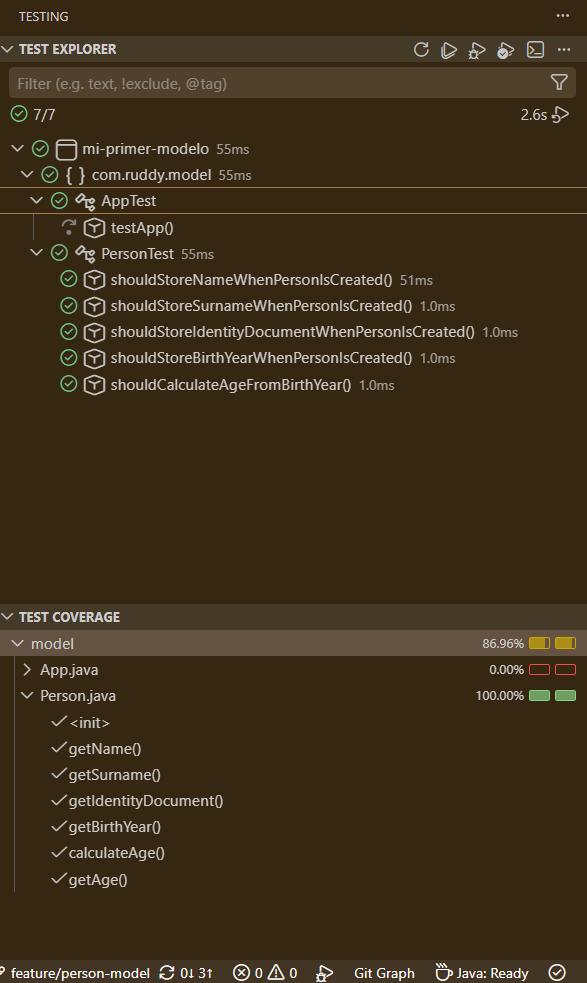
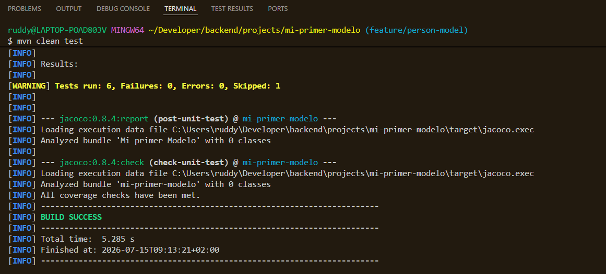
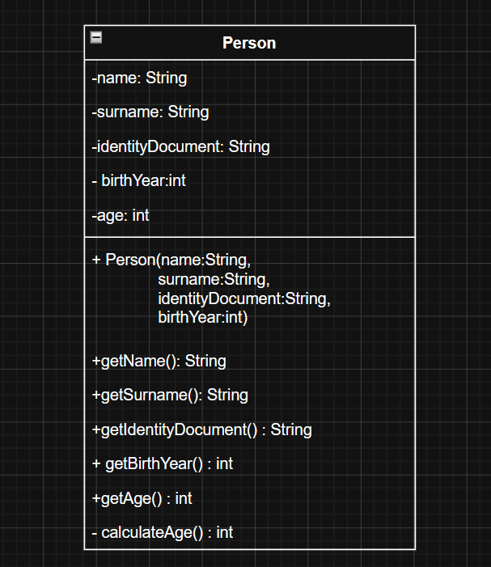

<h1 align="center">Mi Primer Modelo</h1>

<p align="center">
  Modelado de la entidad <strong>Person</strong> utilizando <strong>Java 21</strong>, aplicando principios de Programación Orientada a Objetos y pruebas unitarias con <strong>JUnit 5</strong>.
</p>

<p align="center">

<a href="https://skillicons.dev">


</a>
</p>

<p align="center">

 

</p>

---


# Enunciado de la práctica

## Requisitos

- JDK 21
- Maven
- JUnit
- Hamcrest

## Ejercicio

Modelar el concepto de una persona.

Una persona posee los siguientes atributos:

- Nombre
- Apellido
- Documento de identidad
- Año de nacimiento
- Edad (calculada automáticamente a partir del año de nacimiento)

La clase deberá disponer de un constructor que inicialice todos los atributos necesarios. La edad no será un dato recibido por el constructor, sino que deberá calcularse mediante un método específico.

No es necesaria ninguna salida por consola.


## Tecnologías utilizadas

| Tecnología | Versión |
|------------|---------|
| Java | 21 |
| Maven | 3.x |
| JUnit | 5.9.2 |
| Hamcrest | 3.0 |
| JaCoCo | 0.8.4 |


## Estructura del proyecto

```text
mi-primer-modelo
├── docs
│   ├── diagrams
│   └── images
├── src
│   ├── main
│   └── test
├── .gitignore
├── pom.xml
└── README.md
```


# Modelo de la entidad

La clase `Person` representará a una persona mediante los siguientes atributos:

- Nombre
- Apellido
- Documento de identidad
- Año de nacimiento
- Edad (calculada automáticamente)


## Estado del proyecto

| Estado | Valor |
|---------|-------|
| Desarrollo | ✔ Completada |
| Funcionalidad | ✔ Completada |
| Documentación | - En progreso |
| Metodología | Test Driven Development (TDD) |
| Java | 21 |
| Cobertura mínima requerida | Superior al 70% ✔ Completada |

---

## Criterios de evaluación

- [x] Configuración del proyecto
- [x] Implementación de la clase `Person`
- [x] Constructor
- [x] Cálculo automático de la edad
- [x] Tests unitarios
- [x] Cobertura superior al 70%
- [x] Diagrama UML
- [x] Capturas de pantalla
- [x] Documentación completa

---

# Registro de desarrollo

## ⌱Paso 1 · Configuración del proyecto

### Objetivo

Preparar el entorno de desarrollo para comenzar la implementación del modelo.

### Trabajo realizado

- Creación del proyecto Maven.
- Configuración de Java 21.
- Configuración de dependencias.
- Configuración de JaCoCo.
- Configuración de Checkstyle.
- Configuración del `.gitignore`.
- Creación de la estructura de documentación.
- Creación del README inicial.

**Estado**

✔︎ Completado


## ⌱Paso 2 · Implementación del modelo Person

### Objetivo

Crear la clase `Person` e implementar el primer comportamiento del modelo siguiendo la metodología TDD.

### Requisito

Una persona debe almacenar correctamente el nombre recibido mediante el constructor y permitir acceder a él mediante un método getter.

### Desarrollo

1. Se escribió el primer test unitario para verificar que el atributo `name` se almacenaba correctamente.
2. Se ejecutó el comando:

```bash
mvn clean test
```

3. La compilación falló porque la clase `Person` todavía no existía.
4. Se implementó la clase `Person` con el constructor y el método `getName()`.
5. Se volvió a ejecutar la batería de pruebas obteniendo un resultado satisfactorio.

**Estado**

✔︎  Completado


## ⌱Paso 3 · Implementación de atributos

### Objetivo

Completar el modelo incorporando el resto de atributos definidos en el enunciado.

### Desarrollo

Se añadieron progresivamente los siguientes atributos al modelo, aplicando un ciclo TDD para cada uno de ellos:

- `surname`
- `identityDocument`
- `birthYear`

Cada incorporación incluyó:

- Creación del test correspondiente.
- Implementación del getter necesario.
- Ejecución de la batería de pruebas para verificar el comportamiento esperado.

**Estado**

✔︎ Completado


## ⌱Paso 4 · Cálculo automático de la edad

### Objetivo

Implementar el cálculo automático de la edad a partir del año de nacimiento mediante un método privado, utilizando la API `java.time` para obtener el año actual.

### Requisito

La edad no debe recibirse mediante el constructor, sino calcularse automáticamente utilizando un método específico.

### Desarrollo

1. Se creó un nuevo test unitario para verificar el cálculo de la edad.
2. Se implementó un método privado `calculateAge()` responsable de calcular automáticamente la edad a partir del año de nacimiento.
3. El constructor inicializa el atributo `age` utilizando dicho método.
4. Se añadió el método `getAge()` para acceder al valor calculado.

**Estado**

Completado


### Decisiones de implementación

Para calcular la edad se utilizó la clase `LocalDate` del paquete `java.time`, obteniendo dinámicamente el año actual mediante:

```java
LocalDate.now().getYear()
```

De esta forma, el cálculo de la edad permanece actualizado cada año sin necesidad de modificar el código.

El método `calculateAge()` se declaró con visibilidad `private`, ya que únicamente es utilizado por la propia clase durante la creación del objeto, favoreciendo así el principio de encapsulación.


## ⌱ Paso 5 · Testing y cobertura

### Objetivo

Verificar el correcto funcionamiento del modelo mediante pruebas unitarias y comprobar que se alcanza la cobertura mínima exigida.

### Desarrollo

- Se implementaron pruebas unitarias para todos los comportamientos del modelo.
- Se verificó el correcto funcionamiento mediante `mvn clean test`.
- Se generó el informe de cobertura utilizando JaCoCo.
- Se revisó la cobertura desde la pestaña **Testing** de Visual Studio Code.

**Estado**

✔︎ Completado

---

## Tests unitarios

| Caso de prueba | Estado |
|----------------|--------|
| Constructor |✓ |
| Nombre | ✓|
| Apellido | ✓ |
| Documento de identidad | ✓ |
| Año de nacimiento | ✓ |
| Edad calculada | ✓ |

---
## Cobertura de pruebas

El proyecto alcanza una cobertura superior al **70%**, cumpliendo el requisito establecido para la práctica.






---

## UML

El siguiente diagrama representa la estructura final de la clase `Person`.



---

## Git Workflow

Durante el desarrollo del proyecto se seguirá una estrategia basada en ramas **feature**, integrando cada funcionalidad en la rama **develop** mediante commits atómicos.

---

## Conclusiones

Este proyecto ha permitido reforzar conceptos fundamentales de Programación Orientada a Objetos mediante el modelado de una entidad sencilla.

Además, se ha aplicado la metodología **Test Driven Development (TDD)** para desarrollar cada comportamiento de forma incremental, verificando su funcionamiento mediante pruebas unitarias y alcanzando la cobertura mínima requerida.

---

## Autor

| Nombre | GitHub |
|---------|--------|
| **Ruddy P. Cruz Campoverde** | https://github.com/ruddycruzc |

---

>##### Developer Notes
>
> Todo empezó modelando una persona.
>
> Si el README acaba teniendo más líneas que la propia clase `Person`, prometo que ha sido por motivos educativos.

---
